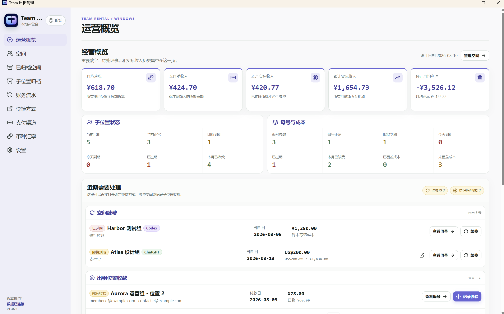
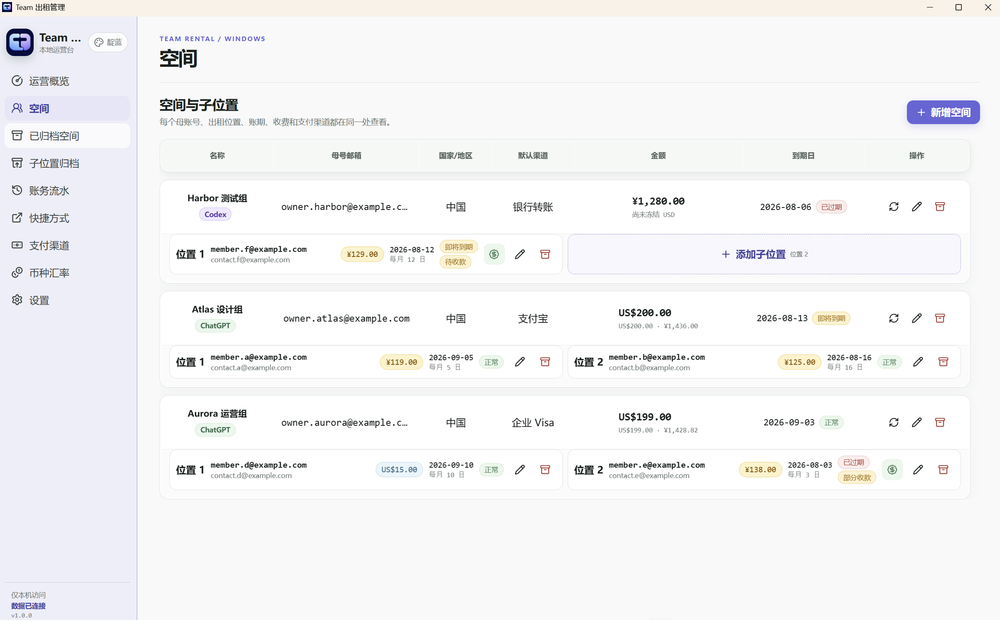
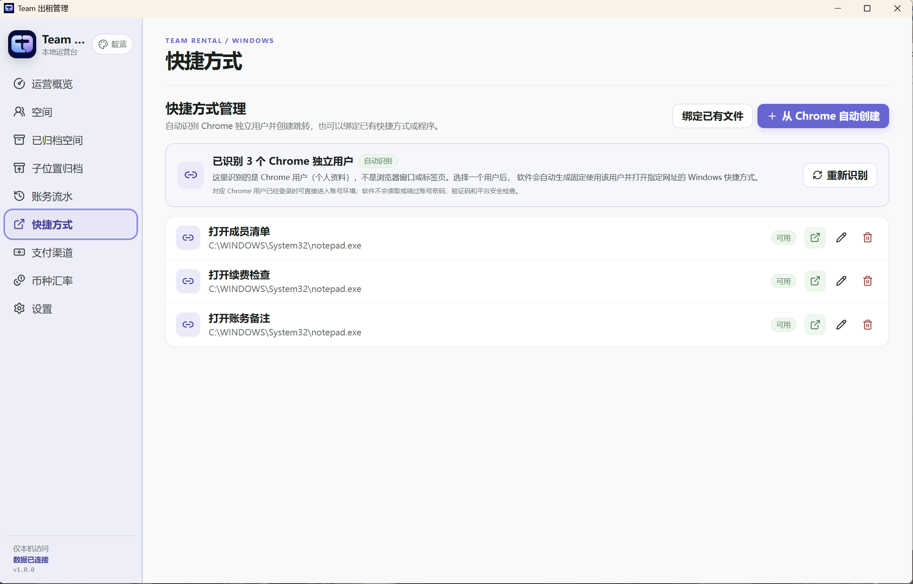
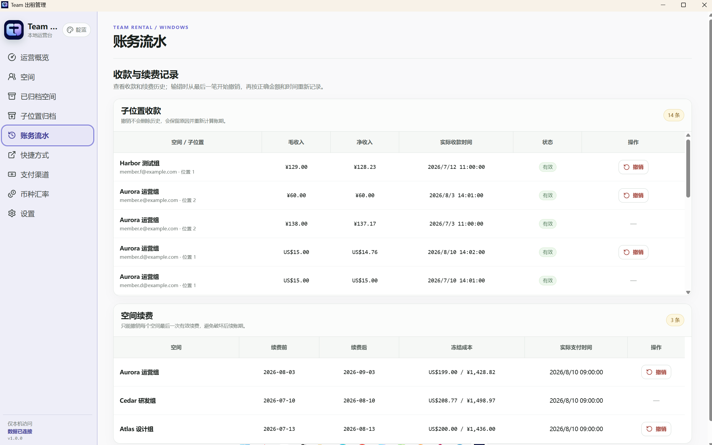

# Team Rental Desk

<p align="center">
  <a href="./README.md">English</a> ·
  <a href="./docs/i18n/README.zh-CN.md">简体中文</a>
</p>

<p align="center">
  
  
  
  <a href="https://github.com/wx2529496539-arch/team-rental-desk/actions/workflows/ci.yml"></a>
</p>

Team Rental Desk is a local-first Windows desktop app for managing shared ChatGPT and Codex spaces, rented seats, payments, renewals, costs, currencies, shortcuts, backups, and reminders. It automatically detects the independent Chrome profiles configured on the computer; choose one and it creates a Windows shortcut that always opens that profile and the specified Team management page. When the selected profile is already signed in, the shortcut can open the matching account environment without repeatedly entering credentials. Team Rental Desk does not store, read, or bypass service passwords. The app UI is currently in Simplified Chinese. Thanks to the original author of [Userchenentao5/team-account-manager](https://github.com/Userchenentao5/team-account-manager) for sharing the project; Team Rental Desk has since been substantially rebuilt.

<p align="center">
  If Team Rental Desk helps you, please consider leaving a ⭐ Star. Thank you to everyone who uses it, shares feedback, and helps it improve.
</p>

## What it does

- Automatically detects standard Chrome profiles, shows how many were found, and creates a `.lnk` for the selected profile, target URL, and optional space binding. A signed-in profile can usually open the matching account or management page without another username or password prompt.
- Provides optional Windows startup checks, bottom-right system notifications, and SMTP email reminders.
- Manages spaces, mother accounts, and up to two active child seats per space.
- Tracks rental or self-use seats, customer changes, due dates, billing cycles, and partial payments.
- Records gross and net income with optional 0%, 0.6%, or 1.6% platform fees.
- Freezes exchange-rate snapshots for payment and renewal history so later rate changes do not rewrite the past.
- Shows receivables, actual income, projected profit, expiry status, cost coverage, monthly income, and per-space performance.
- Supports up to four payment methods per space, including one default method.
- Adds, edits, enables, disables, and safely removes custom currencies while preserving historical formatting.
- Archives, restores, or removes operational records without silently deleting historical payments and renewals.
- Also opens user-selected `.lnk`, `.exe`, `.url`, `.bat`, `.cmd`, and other files; removing a binding never deletes the original file.
- Creates verified SQLite backups manually, on close, or on a schedule.
- Protects the local UI with an optional password and a show/hide password control.

### Jump to the intended mother account with Chrome shortcuts

1. Create a separate [Chrome profile](https://support.google.com/chrome/answer/2364824?co=GENIE.Platform%3DDesktop&hl=en) for each ChatGPT or Codex account, then complete the normal service sign-in once in that profile.
2. Open **Team 出租管理 → 快捷方式**. The page automatically reads the independent users already configured in standard Google Chrome and shows the detected count. It detects Chrome profiles, not the number of open windows or tabs.
3. Choose **从 Chrome 自动创建**, select the matching Chrome user, enter a shortcut name, and keep or change the target URL. The default target is the ChatGPT workspace member-management page. The shortcut can also be associated with a Team Rental Desk space.
4. Choose **创建并保存**. Team Rental Desk creates a Windows `.lnk` inside the `ChatGPT` folder on the current Windows desktop and records it in the shortcuts list. Existing names are never overwritten; a numeric suffix is added instead.
5. Open the shortcut from the **快捷方式** page, or from the **运营概览** work list when it is associated with a space. You can also use **绑定已有文件** when you already have a `.lnk` or want to bind another supported file type.
6. While the selected Chrome profile still has a valid signed-in session, the shortcut normally opens the matching account or management page without another username or password prompt. If the session expires or the service asks for verification, sign in normally in Chrome again. If that Chrome profile is later deleted, the old shortcut does not fall back to the default profile; return to this page, refresh detection, and create a new shortcut. Team Rental Desk reads the local Chrome profile list only; it never reads or bypasses passwords, verification codes, cookies, or service security checks.

## Download

Download the current installer and `SHA256SUMS.txt` from [GitHub Releases](https://github.com/wx2529496539-arch/team-rental-desk/releases/latest).

Officially supported release:

- Windows 10 or Windows 11, x64
- Installer: `Team-Rental-Desk-1.0.0-Setup.exe`
- Per-user installation; administrator access is normally not required

The installer is not code-signed yet. Windows SmartScreen may therefore show an “unrecognized app” warning. Verify the downloaded file first, then choose **More info → Run anyway** only when the SHA-256 value matches `SHA256SUMS.txt` from the same Release.

```powershell
Get-FileHash .\Team-Rental-Desk-1.0.0-Setup.exe -Algorithm SHA256
```

### macOS and Linux

There are no official macOS, Linux, ARM64, or portable builds yet. The accounting rules, SQLite repository, services, React renderer, and typed renderer API are separated from the desktop-platform adapter. The working Windows implementation is isolated under `src/main/platform/windows`; community porters can replace that adapter for target-specific paths, shortcuts, notifications, and startup behavior without rewriting payment or history logic.

#### Run the source on macOS or Linux first

1. Download the repository source and install Node.js 24 with npm.
2. From the source directory, run:

   ```shell
   npm run bootstrap
   npm run dev
   ```

3. This starts the app with isolated development data so the UI, accounting, and database behavior can be inspected. It does not create an installer. Chrome-profile shortcuts, login startup, and native notifications remain visibly unavailable until their target adapters are implemented.

#### Produce a distributable macOS or Linux package

1. Implement the existing target template: `src/main/platform/macos/macos-platform.ts` for macOS or `src/main/platform/linux/linux-platform.ts` for Linux.
2. Connect target-specific Chrome/Chromium profiles, profile-pinned launchers, login/autostart behavior, and desktop notifications.
3. Add the appropriate Electron Builder target, icons, and artifact name in `package.json`. macOS also needs signing and notarization; Linux needs a tested AppImage, deb, or rpm choice. Verify the SQLite native module for the real CPU architecture.
4. Run `npm run typecheck`, `npm run test:platform`, `npm test`, and `npm run build`, then test first install, upgrade, backup/restore, reminders, and database migration on the real target OS.
5. Only after those checks pass should the generated macOS or Linux package be given to normal users. Changing packaging flags alone is not a completed port.

You can give the complete repository to Codex or another coding assistant and explicitly ask it to follow [PORTING.md](./docs/PORTING.md), preserve the accounting rules, and run every validation step. GitHub Actions checks portable code on Windows, macOS, and Ubuntu, but a port remains community-maintained until it passes real packaging, migration, and data-integrity tests on the target. A server edition additionally needs a real authenticated API, HTTPS, concurrency rules, and server backups; this desktop build does not open a network port.

## Screenshots

| Operations overview | Spaces and seats |
| --- | --- |
|  |  |

| Local shortcuts | Payment and renewal history |
| --- | --- |
|  |  |

All screenshots use an isolated fictional demo database. Every displayed account and contact address uses `example.com`.

## First use

1. Install and open **Team 出租管理**.
2. Create any non-empty local login password. There is no built-in default password and no password-length rule.
3. Add payment methods and currencies as needed.
4. Create a space, then add up to two child seats.
5. Use **Settings → Data backup** to choose a backup folder outside the installation and live-data directories.

> [!IMPORTANT]
> **The app password is only a local interface lock.** It does not encrypt the SQLite database or replace Windows sign-in, BitLocker, or operating-system permissions. Turning off startup password verification only removes the login screen. Take extra care on a shared computer.

## Data and backups

The live database is stored at:

```text
%APPDATA%\team-rental-manager\data\team-rental.db
```

Backups are ordinary local folders containing a verified SQLite copy, sanitized settings, integrity results, and a Chinese restore guide. SMTP URLs are removed from backup copies and must be entered again after a restore. Automatic retention can be configured from 3 to 100 completed backups.

Create manual backups regularly and keep an important copy on another drive. Do not edit the live SQLite file while the app is running.

## Network and privacy

Team Rental Desk does not start an HTTP server, listen for LAN connections, upload business records, or collect analytics.

Two features can access the network:

- Exchange rates refresh automatically while the app is open. The app requests public USD reference rates from Coinbase and falls back to Frankfurter when needed. Only requested currency codes are sent; customer, account, payment, and database data are not included.
- Email reminders are sent only after the user enables them and supplies an SMTP URL, sender, and recipient. These values stay in the local database. SMTP credentials are removed from generated backup copies.

Windows notifications remain local. Closing the main window stops scheduled work and exits the app.

## Security model

- Electron renderer sandboxing, context isolation, and disabled Node.js access.
- Explicit preload APIs and validated write inputs.
- SQLite foreign keys, transactions, integrity checks, and historical snapshots.
- Passwords stored as salted `scrypt` hashes, never as plaintext.
- Five failed attempts within five minutes trigger a 30-second local lockout.
- No MFA, remote accounts, cloud sync, or browser login.

The password is only a local interface lock against casual access. It does not encrypt the database or replace a protected Windows account, BitLocker, or physical device security. See [SECURITY.md](./SECURITY.md) for reporting vulnerabilities privately.

## Development

Requirements for source checks:

- Node.js 24
- npm

The official NSIS installer still requires Windows 10/11 x64. Community contributors can run portable type checking, tests, and production compilation on macOS or Linux; this does not create a supported installer by itself.

```powershell
npm run bootstrap
npm run dev
npm run typecheck
npm run test:platform
npm test
npm run build
npm run package:win
```

`npm run bootstrap` performs a clean dependency install without running arbitrary dependency lifecycle scripts, then explicitly installs the audited Electron runtime. `npm run dev` always uses a separate `team-rental-manager-development` profile with fictional demo data. It never opens the installed app's live database. The installer is written to `release/`. Tests cover platform adapters, database migration, payments, renewals, archive/restore behavior, backups, reminders, rate fallbacks, UI contracts, and the isolated development-only screenshot mode.

See [CONTRIBUTING.md](./CONTRIBUTING.md), [architecture notes](./docs/ARCHITECTURE.md), and the [product specification](./docs/PRODUCT_SPEC.md).

## Contributing and support

Bug reports and pull requests are welcome in English or Chinese. Please do not include real account details, customer data, SMTP credentials, databases, or local paths in an Issue.

If Team Rental Desk has helped you, consider leaving a Star, sharing feedback, or offering completely voluntary support. These signals help me understand real-world demand and decide future maintenance and updates. This is a personal project and does not follow a guaranteed release schedule.

<p align="center">
  
</p>

## License

Source code and ordinary documentation are licensed under the [Apache License 2.0](./LICENSE). The app icon and other brand assets are covered separately by [ASSET-LICENSE.md](./ASSET-LICENSE.md). Direct runtime components are summarized in [THIRD_PARTY_NOTICES.md](./THIRD_PARTY_NOTICES.md).

Detailed legal and modification information is provided in [NOTICE](./NOTICE).
